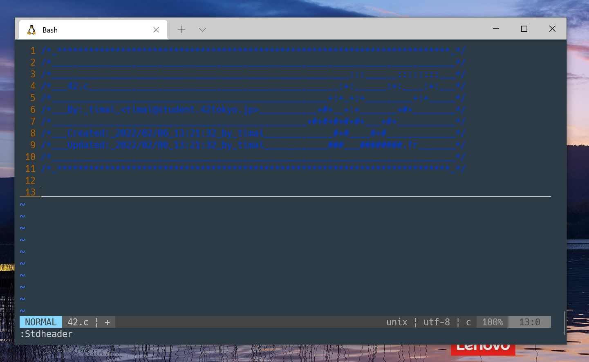

# **42 Header(Bash)**

42 (Tokyo)

### **Description**

Vim用の42ヘッダーです。

### **UNIXでのセットアップ**

`~/.vim/plugin`に `stdheader.vim` をコピーするか、プラグインマネージャーを利用してください。
その後、ユーザー名とメール変数を設定してください。(シェルスクリプトを利用すれば大丈夫です。)

### **使い方**

**NORMAL** モードで `:Stdheader` を入力するか、キーボードの <kbd>F1</kbd>を押してください。

**Linux** の環境の場合、**help** のショートカットキーを無効化してください。

### **Note**

お使いのUbuntuで実行してください:

`$ ./set_header.sh`

### **クレジット**

オリジナルリポジトリ:

[@zazard](https://github.com/zazard) - creator
[@alexandregv](https://github.com/alexandregv) - contributor
[@mjacq42](https://github.com/mjacq42) - contributor
[@sungmcho](https://github.com/lordtomi0325) - contributor

フォーク先(このリポジトリ):
[@101ta28](https://github.com/101ta28)
### **ライセンス**

This work is published under the terms of **[42 Unlicense](https://github.com/gcamerli/42unlicense)**.
